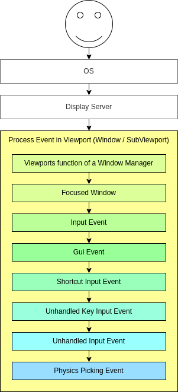
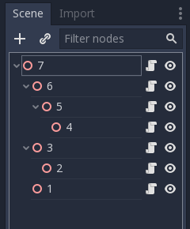

input
===========
window的Viewport对接收到的输入做了很多事情，顺序如下：

~~~~~~~~~~~~~~~~~~~~~~~~~

将事件发送到其子节点和后代节点时,
视口将按照相反的深度优先顺序执行此操作(如下图所示),
从场景树底部的节点开始，到根节点结束。
此过程不包括Windows和SubViewports。

此顺序不适用于控制。_ gui_input（），它基于事件位置或焦点控件使用不同的方法。

UI input
------------------

Mouse Filter
    stop:自己接受信号,并且不传递

    pass,自己接受信号,如果不处理,则传递

    ignore:不接受,传递